# pwn2win - Reversing - The Return of Too Slow (60% done)

## Reverse engineering of an unusual architecture (MS-DOS COM executable) with basic anti-debugging measures (UPX packing, stripped binary) to identify the underlying algorithm, then implementing a faster version to get the flag.

#### Description

`A computer manufactured in the 1980s is on display in the Rhiza museum. That computer is never turned off and is kept running some MS-DOS software. It is said to contain one of the first advanced AI algorithms produced by mankind, which was programmed to answer the problem of faster-than-light space travel. The government keeps the computer running in the hope that someday the program will complete and show the result of its execution. Colonization of other planets would be the only means for humanity to expand again now that, according to the government, humans can't inhabit large regions outside Rhiza.`

`Laura knows that this is obviously nonsense. She suspects the program does something very straightforward, but that could not be implemented efficiently with the computers at the time. Are you able to unveil what this program is computing? Can you get the answer the program would show on screen, but much faster than it does?`

### Triage

After downloading the challenge we see that there are two files, `enc` and `v2_slow.com`. We can run `file *` to quickly get information on the kinds of file we have.

```
bee@blackandyellow:~/hackinghobby/pwn2win/too_slow_writeup$ file *
enc:         ASCII text, with very long lines, with no line terminators
v2_slow.com: FREE-DOS executable (COM), UPX compressed
```

`enc` appears to be a file which is fed into our executable, and will be the basis for our flag. Looking inside, it is basically just 2996 characters of utter gibberish, here is a snippet `vYJ3,K*C=\xkXo4t1HZldt1LR"3p*v,34*xdubE=03Hdw43*f2U3>xv0,9fTHB35f=onG'lK'H,VH3Z1=FM]7x9EUQ-,o<t3X${lB,6R1@<Ss $~9K[C%CwA{^zb}N9}zj.3a9=Zjbx3y.yP<'8j.C.5p=xoC5H-05hvH'')Gv/y4 L%f9lRlE9xL_3:3reQK''Vvn""v5L^,3"gb+7_3fbl#an#=Z,7Q$Q3,t#O$kZFJe# &gAmXRw;\1>Xx_KXQX?4gPi=][vxvmafFSi=Lp(tB1C?4xMoFz*5[E*?hC?y_?H_HxRH31AisEF]_L"X9x3""ve"Xe_H!E$.v!.e!c'!Lvc3e!*e*c81V`.

Additionally, the .com file is UPX compressed. This means we'll want to uncompress it before performing any static analysis.

To run the executable the easiest thing to do is to use dosbox, which is low hassle DOS emulater. 

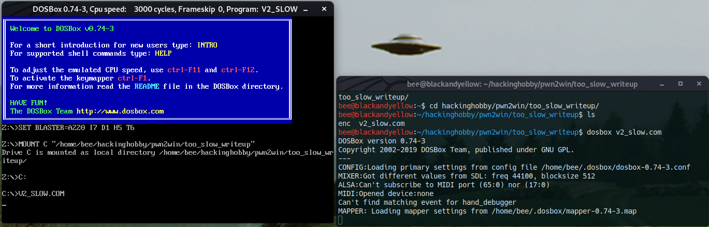

When ran the program effectively stalls and does not output anything. This kind of "slow algorithm" reverse engineering challenge typically make use of incredibly slow algorithms that will effectively never finish, so this isn't unexpected.

##### Side note, dynamic analysis.

This writeup mostly follows my own approach to reverse engineering this binary, which was heavy on static analysis (I was unsure on installing a DOS debugger at first). However, briefly using the DOS debugger early into the challenge would have saved me some trouble later on. It would have confirmed things such as the `enc` file being read and exactly what values were being stored in certain global variables.

### Static Analysis

Now we know roughly what the program does and what to look for, it is time to begin static analysis! I'll be breaking up the static analysis into the varying "layers" I encountered before finally reaching the algorithm.


#### UPX Unpacking

First things first, we decompress the UPX packed binary. This is something most reversers should be familiar with, but if you are not you can simply run `upx -d v2_slow.com`. It is also possible to unpack a binary using dynamic analysis but that simply was not needed here.

#### Importing into GHIDRA

GHIDRA is definitively my decompiler of choice, I imagine steps will be similar in others. Naturally, the first step here is to actually import the COM file into the CodeBrowser, made harder by the fact that there isn't any loader for this kind of binary. However, we should be able to import the file as a "Raw Binary" and make use of the disassembler and decompiler without too much issue. MS-DOS made use of x86 instructions on a 16 bit processor, so we select that option and then import.

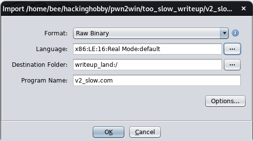

The binary disassembles correctly (mostly); however, it appears that GHIDRA is still struggling to properly understand what it is doing. This error is admittedly not the most helpful.

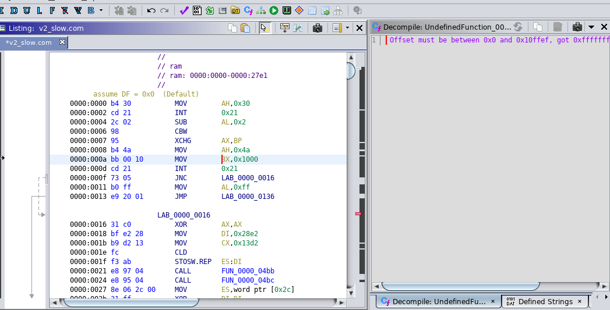

Some research into how MS-DOS loaded COM files into memory can resolve this problem. When loaded into GHIDRA the binary was loaded at 0000:0000. However, the MS-DOS architecture actually always loaded files at 0000:0100. This left the first 256 bytes untouched, which are known as the "Zero page". This zero page contains information required by the binary to run and includes information related to the system. While this wikipedia page is for CP/M (the pre-DOS computer model essentially), it works very similar in DOS systems [https://en.wikipedia.org/wiki/Zero_page_(CP/M)](https://en.wikipedia.org/wiki/Zero_page_(CP/M))

Attempting to set the image base in GHIDRA fails for unclear reasons, so instread I simply create a new binary file with 256 0x00 bytes appended before the main binary and import that instead.

```python
f = open("v2_slow.com", "rb")
b = f.read()
f2 = open("v2_slow.1.com", "wb")
f2.write(b"\x00"*256+b)
```

The binary can then simply be imported into GHIDRA and analysed. We hit "D" to disassemble at 0000:0100 and GHIDRA goes ahead and disassembles most of the program and creates the corresponding functions.

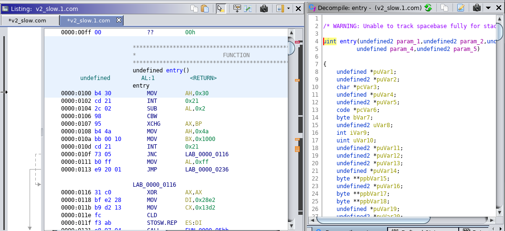

#### Looking for chall relevant code

Since there are a lot of functions to analyse, it is impractical to analyse every single one. As such, I started by looking for "interesting" features. One common way to do this is to check the defined strings, which instantly tells me that this executable makes heavy use of libc and is a stripped binary. The strings shown in the below screenshot will essentially only occur in that scenario, since they will be printed if libc functions like `malloc` encounter trouble.

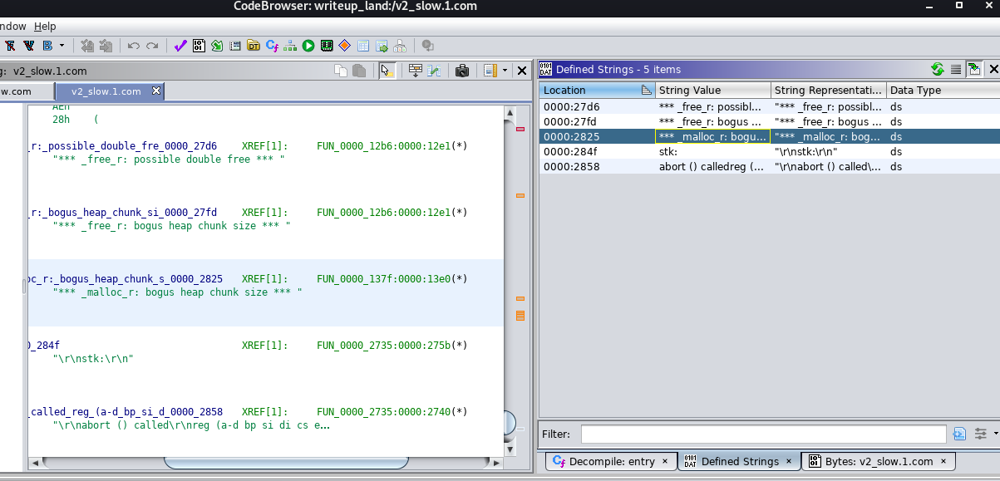

This means we will have many unnamed functions that are actually common libc functions, meaning reverse engineering them and how they work is largely a waste of time. We can typically identify what a libc function does by looking at what functions it calls, any syscalls involved, and the arguments/context it is called in. For reference, I made use of the following pdf outlining DOS syscalls [https://eecs.wsu.edu/~ee314/handouts/dosref.pdf](https://eecs.wsu.edu/~ee314/handouts/dosref.pdf).

At this point, I figured the fastest way to find chall relevant code would be to start at the `entry` function at offset 0000:0100 and go from there. The first bit of code that happens, which does NOT decompile well in ghidra, are two syscalls. All syscalls in DOS send a 0x21 interrupt, and the type of syscall is specified by the AH register. Looking in the assembly view you can easily figure out what value is stored in the AH register. In the first case we have the following:

       0000:0100 b4 30           MOV        AH,0x30
       0000:0102 cd 21           INT        0x21
       0000:0104 2c 02           SUB        AL,0x2
       0000:0106 98              CBW


This is a 0x30 syscall which corresponds to getting the DOS version number. This is then compared to the number 2, likely checking the DOS version is valid. If it is invalid, it will exit early. 

       0000:0108 b4 4a           MOV        AH,0x4a
       0000:010a bb 00 10        MOV        BX,0x1000
       0000:010d cd 21           INT        0x21

This next syscall is 0x4a, which corresponds to modifying an allocated memory block.

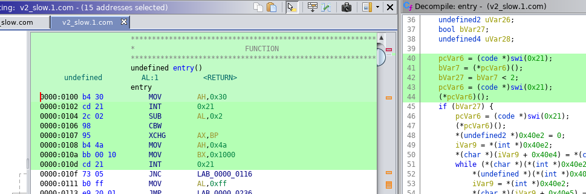

Now while these are interesting specifics, the longer I looked at this code the more it felt *machine made*. That this some kind of libc abstraction that would eventually get around to calling the challenge code. Moving down the main function, I go for the two functions that are first called. The first of which appears to be a no-op, simply instantly returning. 

                 FUN_0000_05bb()
       0000:05bb c3              RET

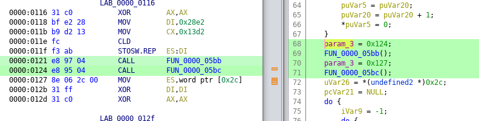

However, the second function called quickly reminded me of a common C paradigm. The function looks at a global array in memory and calls the array values as function pointers until it encounters one which is set to -1. This appears to be an INIT array. In this case there are no values in this array, but this was the first big indicator to me that I was inside a function similar to libc_start_main.

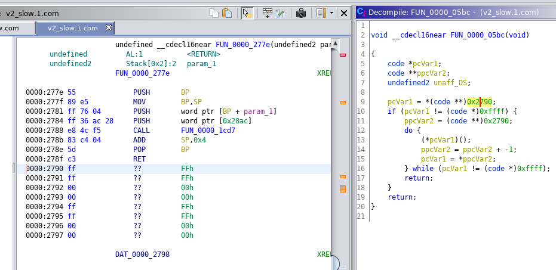

I jump ahead towards the end of the function where there is a mess of around 100 lines of code which involves goto statements, nested while loops, and lots of comparisons to single byte values. While I did not finish decompiling it, it is apparent that is parsing command line arguments. Some of the bytes it is checking for include 0x22 or the double quotation mark, 0x5c or the backslash, or 0x20 the space. All of these characters have special meaning in command line arguments and I am confident it is parsing out a string.

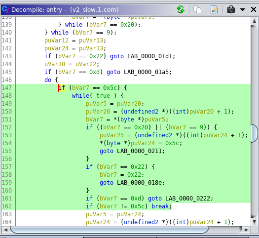

Additionally, just before the loops begin there is a pointer set to 0x81. If you look at the diagram for what is stored in the zero page, the values in 0x81 to 0xff contain information following the program name passed on the command line. This confirms my suspicions!

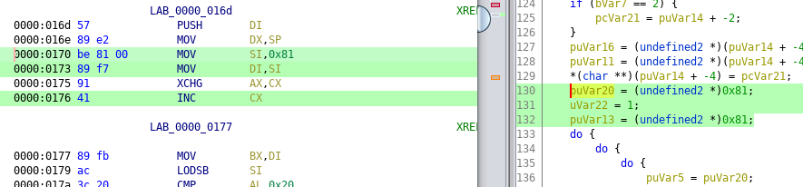

Now arguments have been parsed, where they get passed is likely the main function. We can create a function graph and look for where the argument parser eventually "ends" and passes its data. This can also be done by simply scrolling about the code. We eventually can find the "node" that the data is passed on to. This contains two functions, one of which is later confirmed to be the main function and the other appears to be an `exit` function of sorts.

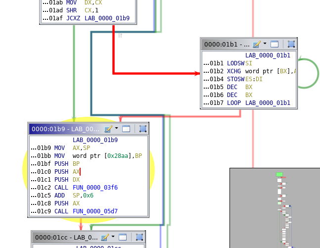

Looking inside the first function, we quickly establish this is a traditional main function. The two paramaters the function takes are quickly used in a familiar `argc` and `argv` fashion, with an if statement checking if there are enough arguments and if so accessing `argv` like it is an array for the second argument `argv[1]`

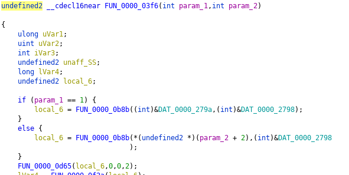

#### Deciphering main

To better understand main we're best off by doing some "boring" ghidra work. Naming variables, naming functions, and setting the appropriate data types will go a long way in making it easier to decipher the decompilation.  Here I make a couple of "guesses" based on the arguments being used and how variables appear. 

